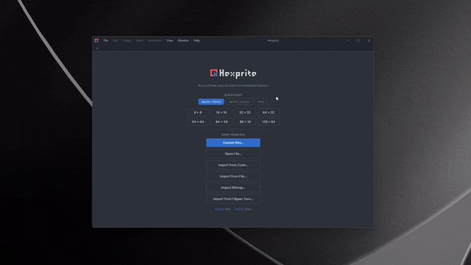
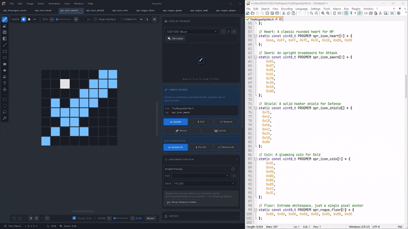
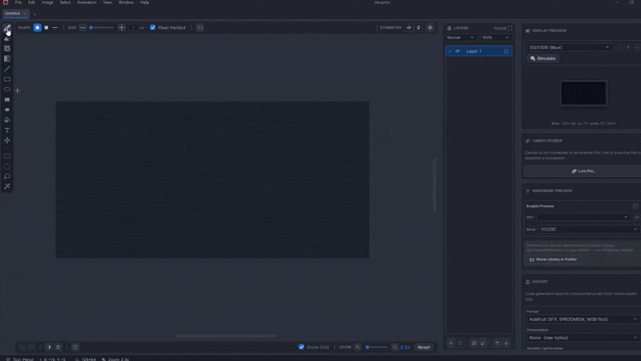
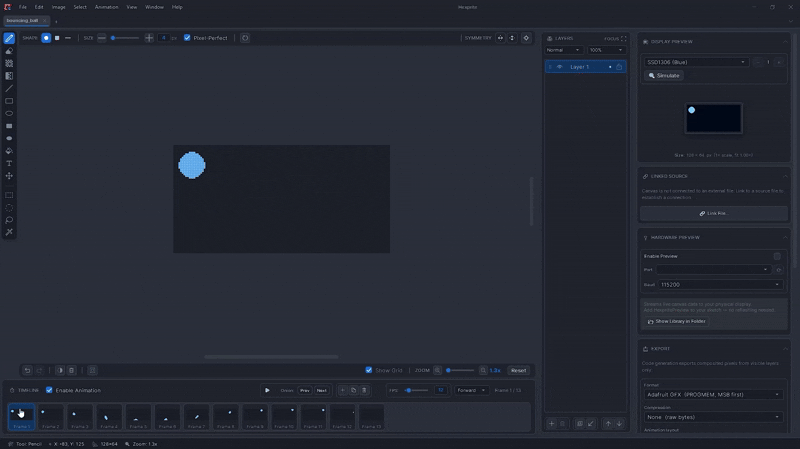
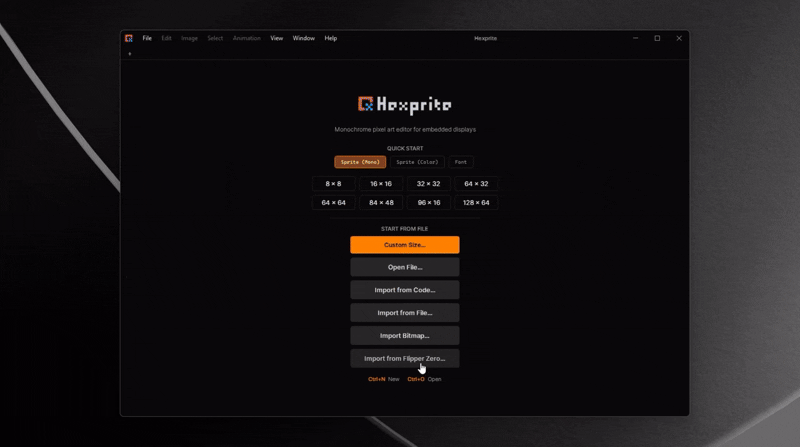

  

  **The dedicated pixel art and font editor for embedded displays.**

  
  
  

---

Hexprite is a indie desktop application specifically engineered for **embedded software engineers, IoT creators, makers, pixel artists, and retro-computing hardware enthusiasts**.

Unlike general-purpose art tools (like Photoshop or Aseprite), Hexprite is purpose-built with a **strict 1-bit monochrome data engine** to bridge the gap between creative pixel art design and the rigid memory, format, and display constraints of embedded hardware displays (OLED, e-Paper, Flipper Zero etc.).

Currently, it features a strict 1-bit monochrome editor and a custom bitmap font engine. A dedicated color mode for TFT/RGB displays is planned for a future release.

## ✨ Key Features

 

  
<b>1-Bit Graphics Engine & Editor</b>

   
  
    
  
<b>Everything you need to design pixel-perfect monochrome graphics without the bloat.</b>

  <ul>
    <li><b>Complete Tool Suite:</b> Comprehensive drawing and editing tools.</li>
    <li><b>Advanced Controls:</b> Advanced selection, move, transformation control, and canvas operations.</li>
    <li><b>Clean Interface:</b> Distraction-free environment focused on pixel manipulation.</li>
  </ul>

  
<b>Sprite Extraction</b>

   
  
    
  
<b>Turn mystery C-arrays back into visual art. No math, no spreadsheets—just point Hexprite at your .h file and watch every embedded sprite reconstruct instantly.</b>

  <ul>
    <li><b>Full-File Scanning:</b> Scans entire `.h`, `.c`, or `.py` files to extract embedded sprites.</li>
    <li><b>Smart Detection:</b> Automatically detects variable names, width, height, code snippet, and format.</li>
    <li><b>Visual Thumbnail Previews:</b> Mini visual thumbnails let you inspect and select sprites before importing.</li>
  </ul>

  
<b>Direct Source File Syncing</b>

   
  
    
  
<b>Stop juggling web converters, formatting templates, and tedious copy-pasting. Hexprite links directly to your project’s .c, .h, or .py files.</b>

  <ul>
    <li><b>Direct File Updating:</b> Hit Save in Hexprite, and your source code updates instantly in VS Code, CLion, or PlatformIO.</li>
    <li><b>Two-Way Syncing:</b> Manual edits from your source code sync automatically in Hexprite.</li>
    <li><b>Rollback Support:</b> You can restore everything to original states in case you mess anything up.</li>
  </ul>

  
<b>Live Hardware Preview</b>

   
  
    
  
<b>Connect your Arduino, ESP32, STM32, or Raspberry Pi Pico via USB and watch your sprites come to life on physical OLED/e-Paper displays while you draw.</b>

  <ul>
    <li><b>Live Canvas Mirroring:</b> Every pencil stroke, shape, and selection reflects instantly on hardware.</li>
    <li><b>Real-Time Animation Playback:</b> Preview multi-frame animations at full frame rates over high-speed serial (up to 921.6k baud).</li>
    <li><b>No Firmware Overwrites:</b> Drop 3 lines into your Arduino/PlatformIO sketch—Hexprite takes over the display when drawing and gives it back when you're done.</li>
  </ul>

  
<b>Embedded Typography</b>

   
  
    
  
<b>Go beyond sprites with a dedicated, professional embedded bitmap font editor built from the ground up for microcontroller displays.</b>

  <ul>
    <li><b>Visual Glyph Editing:</b> Design custom 1-bit typefaces with interactive baseline, ascent, descent, and X-advance overlays.</li>
    <li><b>Multi-Framework Export:</b> One-click export to <b>Adafruit GFX</b>, <b>u8g2 (BDF)</b>, and <b>LVGL (v8/v9)</b> with tight auto-cropping for minimum Flash usage.</li>
    <li><b>Universal Font Importer:</b> Convert TrueType (`.ttf`), BMFont (`.fnt`), or sprite sheets into editable monochrome pixel fonts.</li>
  </ul>

  
<b>Animation Studio</b>

   
  
    
  
<b>Bring 1-bit art to life. Design, onion-skin, preview, and export frame-by-frame animations directly into embedded C-arrays, animated GIFs, and Flipper Zero packages.</b>

  <ul>
    <li><b>Animation Timeline:</b> Multi-frame timeline management with configurable framerates, onion skinning, batch frame operations, and playback style.</li>
    <li><b>Microcontroller-Ready Code:</b> One-click export to `PROGMEM` frame arrays, pointer lookup tables, and delay timings for Arduino, ESP32, STM32, and Flipper Zero.</li>
    <li><b>GIF & Flipper Zero Export:</b> Export scaled animated GIFs for your documentation or native `.bm` animation bundles for Flipper Zero.</li>
  </ul>

  
<b>Advanced Dithering</b>

   
  
    
  
<b>Turn photos and graphics into striking monochrome art for your OLED, LCD, or e-Paper display.</b>

  <ul>
    <li><b>Photo-to-Pixel Mastery:</b> Convert any full-color photo or sketch into high-contrast 1-bit art using 6 mathematical dithering algorithms.</li>
    <li><b>Zero Muddy Artifacts:</b> Smart edge locking and adaptive shadow balancing ensure silhouettes stay sharp and readable on tiny OLED screens.</li>
    <li><b>Native Dither Tooling:</b> Draw, shade, and fill with interactive dither patterns directly inside the pixel editor.</li>
  </ul>

  
<b>Flipper Zero Integration</b>

   
  
    
  
<b>No Python scripts. No manual meta.txt editing. Hexprite is purpose-built to read, animate, and export Flipper Zero formats natively.</b>

  <ul>
    <li><b>Direct `.bm` File Support:</b> Open and save native `.bm` bitmap icons and animations directly from your desktop.</li>
    <li><b>Automatic Heatshrink Compression:</b> Encodes frames with Flipper's native compression engine for minimal SD card and Flash footprint.</li>
    <li><b>FAP Asset Pipeline:</b> Export ready-to-blit `.bm` and `.xbm` assets for your custom C/C++ Flipper applications.</li>
  </ul>

 

## 🚀 Why I Built Hexprite

I always wanted to develop my own software or game. My actual day job is graphic design, not coding. I learned some programming back in university, got interested in Unity, and built a couple of personal tools using .NET WPF. I also played around with an Arduino UNO a little bit back then. But even though I knew how to code, I never pursued it as a career.

All of this changed about six months ago. I decided to make my own physical digital Pomodoro timer. A quick online search told me I would need an ESP32, a battery, a rotary encoder, some wires, and an OLED display. I bought the parts and just started playing with them. I say "playing" because the ESP32 literally felt like a toy for adults. I learned so much, and the time I spent watching [The Cherno](https://www.youtube.com/@TheCherno)'s C++ tutorials during university finally paid off.

Watching his game engine series gave me another idea. I decided to make a custom game engine for my ESP32 called Klick32, inspired by the Arduboy. I was able to get something working in just a week, but I ran into a really annoying problem. My engine used C++ arrays to represent the game sprites. I was drawing them in Photoshop, using a web converter to turn them into byte arrays, and then manually copying and pasting the text into my code. It was incredibly tedious. I eventually wrote a Python script to automate the PNG conversion, but it still felt clunky. Because of my graphic design background, I really wanted a visual and interactive way to do this.

That frustration led me to create Hexprite. I have spent the last five months working almost full-time on this project. I built it using .NET WPF because it was the only desktop framework I actually knew. That is why Hexprite only supports Windows right now. Sorry to the Linux and Mac users! What started as a simple GUI tool to solve my own problem just kept growing as I added more features. Now, I finally feel comfortable sharing it with the public.

### The Current State of Hexprite

Right now, the software is in beta. I plan to actively keep developing Hexprite and make it useful to the community. In the future, I also want to release a version with full color display support, which will require more funding to pull off. I really hope this tool saves you as much time as it saves me.

## 🔓 The $500 Open-Source Goal

Hexprite is currently distributed as a closed-source Freeware application. I am committed to keeping the core monochrome features entirely free forever.

Once we reach $500 in community donations, the complete Hexprite Monochrome codebase (C# / WPF) will be released under an open-source license.

## 📄 License

Hexprite is licensed under the **Freeware End-User License Agreement (EULA)**.

See the [LICENSE](LICENSE) file for full details. In short, the software is free to use for personal, educational, and internal commercial purposes (such as creating assets for your hardware or software projects).

## 🔗 Links

- **Website**: [hexprite.com](https://hexprite.com)
- **Discord**: [Join the Community Server](https://discord.gg/DYKBZDfBz)
- **Issues & Bugs**: Please use the built-in Bug Report dialog or open an issue on GitHub.
