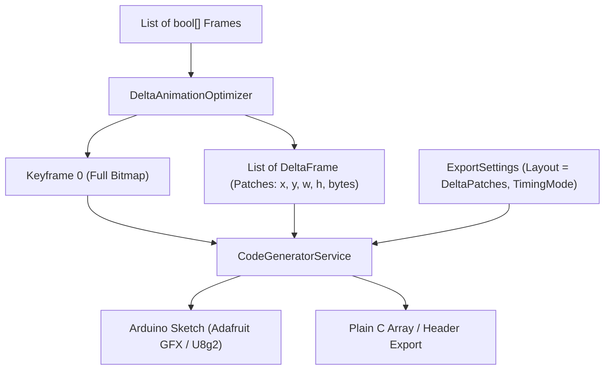

# Delta / Bounding-Box Frame Optimization for Microcontroller Animations

## 1. Executive Summary & Problem Statement
When rendering multi-frame animations (e.g., 70+ frames of 128×64 facial expressions for a robotics display on an ESP32-C3 or AVR Arduino), exporting uncompressed full-frame bitmaps consumes substantial memory (1,024 bytes per frame = 71.7 KB for 70 frames). Storing 12+ expressions easily overwhelms the flash budget or limits firmware features.

However, in facial expressions and sprite animations, vast areas of the screen (background, head contours, static cheeks) remain identical between consecutive frames. Only localized regions change (e.g., blinking eyes, moving mouth).

This design introduces **Delta Patches (Bounding Box)** animation export layout to Hexprite:
1. **Frame 0 (Keyframe):** Stored as a complete baseline 1-bit bitmap.
2. **Frames 1..N-1 (Delta Frames):** Encoded as compact lists of dirty bounding-box patches `(x, y, w, h, data)`.
3. **Adaptive Clustering:** Automatically groups changed pixels into separate disjoint patches (e.g. eyes vs mouth) or merges them if close together, based on an exact byte-cost heuristic.
4. **Zero-RAM Runtime Playback:** Generated Arduino sketches for Adafruit GFX and U8g2 directly overwrite only dirty patches in the display buffer without clearing the screen, providing flicker-free playback and up to 80-90% flash savings.

---

## 2. Architecture & Components



### Component Details
1. **`AnimationExportLayout.DeltaPatches` (Core):**
   - Added to `AnimationExportLayout` enum in `ExportSettings.cs`.
   - Default remains `ArrayOfFrames` (100% backward compatible).
2. **`DeltaAnimationOptimizer` (Service):**
   - Pure service in `Hexprite.Services` with zero UI dependencies.
   - Computes pixel-level boolean difference masks between consecutive frames.
   - Performs connected-component analysis and greedy cost-benefit bounding-box clustering.
   - Extracts 1-bit packed bitmap rows for each patch.
3. **`CodeGeneratorService` (Service):**
   - Emits PROGMEM keyframe array, contiguously serialized `_DELTAS` stream, and `_FRAME_OFFSETS` table.
   - Generates minimal inlined `drawDeltaFrame` helper for Adafruit GFX and U8g2.
   - Produces flicker-free loops for both `BlockingDelay` and `NonBlockingMillis`.
4. **UI Integration:**
   - Adds "Delta Patches (Bounding Box)" to `CboAnimationLayout` in `SidebarPanel.xaml` and `CodeOutputWindow.xaml`.
   - Reactive bindings update code generation in real time.

---

## 3. On-Device Data Structure & Stream Format

### 3.1 Data Format Specification
- **Keyframe 0:**
  ```cpp
  const uint8_t PROGMEM {NAME}_FRAME_0[{FRAME_BYTES}] = {
    // Standard row-packed 1-bit bitmap
  };
  ```
- **Delta Stream (`{NAME}_DELTAS`):**
  A contiguous array of unsigned 8-bit bytes in `PROGMEM`:
  ```text
  [Frame 1 Data] [Frame 2 Data] ... [Frame N-1 Data]
  ```
  Where each frame's data chunk consists of:
  ```text
  uint8_t numPatches;
  For each patch (0 .. numPatches - 1):
    uint8_t x;                      // Top-left X in display coordinates (0 .. width - 1)
    uint8_t y;                      // Top-left Y in display coordinates (0 .. height - 1)
    uint8_t w;                      // Width in pixels (1 .. width)
    uint8_t h;                      // Height in pixels (1 .. height)
    uint8_t data[((w + 7) / 8) * h];// 1-bit monochrome MSB-first bitmap rows
  ```
- **Offset Table (`{NAME}_FRAME_OFFSETS`):**
  ```cpp
  const uint16_t PROGMEM {NAME}_FRAME_OFFSETS[{NUM_FRAMES - 1}] = {
    0, 128, ...
  };
  ```
  Enables $O(1)$ random seek or streaming into any frame without decoding previous deltas in memory.

### 3.2 Efficiency Analysis
- **Zero-Change Frame:** Consumes exactly **1 byte** (`numPatches = 0`).
- **Single Eye Blink (20×14):** $4 \text{ bytes header} + 42 \text{ bytes data} + 1 \text{ byte frame header} = 47 \text{ bytes}$ (vs 1,024 bytes).
- **Two Eyes + Mouth:** ~127 bytes total (vs 1,024 bytes, ~88% savings).

---

## 4. Differential Clustering & Extraction Algorithm

### 4.1 Diff Mask Calculation
For each frame $k \in [1, N-1]$ relative to frame $k-1$:
$$\text{Diff}[x, y] = \text{Frame}_k[x, y] \ne \text{Frame}_{k-1}[x, y]$$
If $\forall (x, y), \text{Diff}[x, y] = \text{false}$, return an empty `DeltaFrame` with `Patches = []`.

### 4.2 Initial Connected Components
1. Perform 8-way flood-fill (breadth-first search) on $\text{Diff}$ to discover isolated islands of changed pixels.
2. For each island, compute its tight bounding box $[x_{\min}, y_{\min}, x_{\max}, y_{\max}]$.

### 4.3 Greedy Cost-Benefit Clustering
Define the byte cost function for storing a bounding box of width $w$ and height $h$:
$$\text{Cost}(w, h) = 4 + \left(\left\lfloor \frac{w + 7}{8} \right\rfloor \times h\right)$$
Where 4 is the patch descriptor header size $(x, y, w, h)$.

Iteratively evaluate all pairs of candidate bounding boxes $(A, B)$:
- Let $M = A \cup B$ be the union bounding box.
- If $\text{Cost}(M) \le \text{Cost}(A) + \text{Cost}(B)$:
  Merge $A$ and $B$ into $M$.
- Repeat until no further merges reduce total byte size.

### 4.4 Full-Frame Cap Guard
If the total byte cost of all patches in a frame exceeds a full frame's raw byte size:
$$\sum \text{Cost}(P_i) \ge \left\lfloor \frac{\text{width} + 7}{8} \right\rfloor \times \text{height}$$
Collapse into a single bounding box covering all changed pixels or the entire frame $(0, 0, \text{width}, \text{height})$.

### 4.5 Bitmap Data Extraction
For each finalized bounding box $(x, y, w, h)$:
- Extract pixel values from $\text{Frame}_k$ (the new visual state).
- Pack pixels MSB-first into bytes, $\lceil w / 8 \rceil$ bytes per row.

---

## 5. Playback Runtime Implementation

### 5.1 Adafruit GFX Runtime
```cpp
// Helper to blit delta patches directly from flash
void drawDeltaFrame(const uint8_t* p) {
  uint8_t numPatches = pgm_read_byte(p++);
  for (uint8_t i = 0; i < numPatches; i++) {
    uint8_t px = pgm_read_byte(p++);
    uint8_t py = pgm_read_byte(p++);
    uint8_t pw = pgm_read_byte(p++);
    uint8_t ph = pgm_read_byte(p++);
    // Overwrites both 1s and 0s in one pass without clearing the full screen
    display.drawBitmap(px, py, p, pw, ph, SSD1306_WHITE, SSD1306_BLACK);
    p += ((pw + 7) / 8) * ph;
  }
}
```

#### Non-Blocking `millis()` Loop
```cpp
void loop() {
  static unsigned long lastFrameTime = 0;
  static int currentFrame = 0;
  unsigned long now = millis();

  if (now - lastFrameTime >= (1000UL / {UPPER}_FPS)) {
    lastFrameTime = now;
    if (currentFrame == 0) {
      display.clearDisplay();
      display.drawBitmap(0, 0, {UPPER}_FRAME_0, {UPPER}_WIDTH, {UPPER}_HEIGHT, SSD1306_WHITE);
    } else {
      drawDeltaFrame(&{UPPER}_DELTAS[{UPPER}_FRAME_OFFSETS[currentFrame - 1]]);
    }
    display.display();
    currentFrame = (currentFrame + 1) % {UPPER}_FRAMES;
  }
}
```

#### Blocking `delay()` Loop
```cpp
void loop() {
  display.clearDisplay();
  display.drawBitmap(0, 0, {UPPER}_FRAME_0, {UPPER}_WIDTH, {UPPER}_HEIGHT, SSD1306_WHITE);
  display.display();
  delay(1000 / {UPPER}_FPS);

  for (int i = 0; i < {UPPER}_FRAMES - 1; i++) {
    drawDeltaFrame(&{UPPER}_DELTAS[{UPPER}_FRAME_OFFSETS[i]]);
    display.display();
    delay(1000 / {UPPER}_FPS);
  }
}
```

### 5.2 U8g2 Runtime
For U8g2, each patch clears its bounding box then draws the new content:
```cpp
void drawDeltaFrame(const uint8_t* p) {
  uint8_t numPatches = pgm_read_byte(p++);
  for (uint8_t i = 0; i < numPatches; i++) {
    uint8_t px = pgm_read_byte(p++);
    uint8_t py = pgm_read_byte(p++);
    uint8_t pw = pgm_read_byte(p++);
    uint8_t ph = pgm_read_byte(p++);
    u8g2.setDrawColor(0);
    u8g2.drawBox(px, py, pw, ph);
    u8g2.setDrawColor(1);
    u8g2.drawBitmap(px, py, (pw + 7) / 8, ph, p);
    p += ((pw + 7) / 8) * ph;
  }
}
```

---

## 6. Verification & Test Plan

1. **Differential Roundtrip Reconstruction Test:**
   - Create multi-frame animation with complex pixel changes (blinking eyes, moving mouth, idle holds).
   - Run `DeltaAnimationOptimizer.Optimize(...)`.
   - Reconstruct each frame by stamping patches over Frame 0 in RAM.
   - Assert $100\%$ bit-exact equality with the original frames.
2. **Clustering Boundary Tests:**
   - Two distant clusters (gap > 4-byte threshold) remain separate.
   - Two adjacent clusters (gap < 4-byte threshold) merge into one box.
   - Frame identical to predecessor produces `numPatches = 0`.
   - Inverted full frame produces single bounding box $(0, 0, w, h)$.
3. **Code Generator Unit Tests:**
   - Verify generated code contains `{NAME}_FRAME_0`, `{NAME}_DELTAS`, `{NAME}_FRAME_OFFSETS`.
   - Verify `drawDeltaFrame` helper generated in sketch.
   - Verify `millis()` loop branches on `currentFrame == 0` vs `currentFrame > 0`.
   - Verify both Adafruit GFX and U8g2 formats.
4. **Chaos Fuzzer:**
   - Add `AnimationExportLayout.DeltaPatches` to the randomized 10,000-iteration chaos fuzzer.
