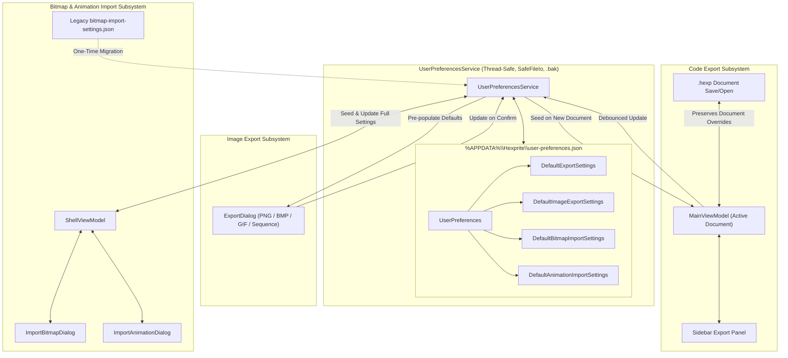

# Unified Persistence for Bitmap Import and Export Settings

## 1. Executive Summary & Problem Statement

Hexprite provides extensive configuration options across image/bitmap import and multi-format code/image export. However, persistence across user sessions and document lifecycles exhibits several critical gaps and inconsistencies:

1. **Loss of Animation Import Settings:** When importing animated GIF sequences, `AnimationImportSettings` derives from `BitmapImportSettings` with additional fields (`TargetFps`, `MaxFrames`, `UniformSampling`, `TrimTrailingBlankFrames`). However, `ShellViewModel`'s persistence logic slices the object to `BitmapImportSettings`, causing all animation-specific settings to revert to hardcoded defaults (8 FPS, 32 frames, true, true) on every dialog open.
2. **Fragmented Storage Locations:** Bitmap import settings are stored in an isolated, uncoordinated JSON file (`%APPDATA%\Hexprite\bitmap-import-settings.json`), while general editor preferences are stored in `%APPDATA%\Hexprite\user-preferences.json`.
3. **No Global Persistence for Code Export Settings:** In `MainViewModel`, `ExportSettings` (export format, timing mode, animation layout, compression, uppercase hex, comments, dimension constants, etc.) are only persisted when saved inside a `.hexp` document. Newly created documents always revert to hardcoded defaults, forcing users to repeatedly reconfigure their preferred target environment (e.g. U8g2, 16 bytes/line, uppercase hex) for every new sprite.
4. **No Persistence for Image / GIF Export Dialog Settings:** `ImageExportSettings` (format, scale factor, color mode, grid toggle, and GIF options including FPS, looping, dithering, and delta optimization) are only kept in memory on the active `SpriteState` and are completely lost when creating new documents or restarting Hexprite.
5. **No Unified Reset to Defaults:** Users have no simple, reliable mechanism to restore export or import configurations to factory defaults.

This design introduces a **centralized, thread-safe persistence architecture** within [`UserPreferencesService`](file:///H:/Repositories/hexprite/Hexprite/Services/UserPreferencesService.cs) that unifies all import and export defaults, guarantees document isolation, preserves full animation sequence parameters, and provides one-click factory reset capabilities.

---

## 2. Architecture & Components



### Component Roles

1. **[`UserPreferencesService`](file:///H:/Repositories/hexprite/Hexprite/Services/UserPreferencesService.cs):**
   - Single source of truth for global defaults.
   - Provides deep-cloned accessors (`GetDefaultExportSettings()`, `GetDefaultImageExportSettings()`, `GetDefaultBitmapImportSettings()`, `GetDefaultAnimationImportSettings()`).
   - Handles atomic disk persistence via `SafeFileIo`, `.bak` backup creation, and in-memory synchronization locks.
   - Automatically migrates existing legacy `bitmap-import-settings.json` on first run.
2. **[`MainViewModel`](file:///H:/Repositories/hexprite/Hexprite/ViewModels/MainViewModel.Export.cs) (Code Export):**
   - When a new document is created, seeds its `ExportSettings` from `UserPreferencesService.GetDefaultExportSettings()`.
   - When an existing `.hexp` document is loaded, document-specific settings take precedence.
   - When the user modifies sidebar export settings, updates the active document and debounces a write to `UserPreferencesService` without overwriting document-specific names.
3. **[`ExportDialog`](file:///H:/Repositories/hexprite/Hexprite/Views/ExportDialog.xaml.cs) (Image & GIF Export):**
   - Seeds from document's `SpriteState.ImageExportSettings`, falling back to `UserPreferencesService.GetDefaultImageExportSettings()`.
   - On export confirmation, saves settings to `SpriteState.ImageExportSettings` and commits the new defaults to `UserPreferencesService`.
   - Offers a "Reset to Defaults" button to restore factory settings immediately.
4. **[`ShellViewModel`](file:///H:/Repositories/hexprite/Hexprite/ViewModels/ShellViewModel.cs) & Import Dialogs:**
   - Single-image import retrieves and persists `DefaultBitmapImportSettings`.
   - Animation import retrieves and persists full `AnimationImportSettings` (including `TargetFps`, `MaxFrames`, `UniformSampling`, and `TrimTrailingBlankFrames`).
   - Common conversion fields (threshold, dithering, scaling, brightness, contrast, gamma) stay synchronized between single-image and animation defaults.

---

## 3. Schema & Data Model Specifications

### 3.1 `UserPreferences` Extensions

[`UserPreferences`](file:///H:/Repositories/hexprite/Hexprite/Services/UserPreferencesService.cs) is extended with four properties:

```csharp
public sealed class UserPreferences
{
    // ... existing preferences ...

    // Code Generation Export Defaults
    public ExportSettings DefaultExportSettings { get; set; } = new();

    // Image / GIF Export Defaults
    public ImageExportSettings DefaultImageExportSettings { get; set; } = new();

    // Bitmap Monochrome Import Defaults
    public BitmapImportSettings DefaultBitmapImportSettings { get; set; } = new();

    // Animated GIF / Sequence Import Defaults
    public AnimationImportSettings DefaultAnimationImportSettings { get; set; } = new();
}
```

### 3.2 Isolation & Sanitization Rules

To prevent document-specific or file-specific state from corrupting global preferences:

| Setting Category | Field | Sanitization Rule |
| :--- | :--- | :--- |
| **Code Export** | `SpriteName` | **Excluded** from global preferences. Global default is always `"mySprite"`; document names and filenames are never stored in `user-preferences.json`. |
| **Code Export** | `ExportAsAnimation` | **Dynamic**. Bound to the document's animation state (`IsAnimationEnabled`), not statically locked in preferences. |
| **Bitmap Import** | `MaxDimension` | **Normalized**. Clamped to `SpriteState.MaxDimension` (128) during persistence so that a small/large imported image does not artificially constrain future imports. |
| **Animation Import** | `TargetFps` | **Clamped** between 1 and 24 FPS. Persisted across sessions. |
| **Animation Import** | `MaxFrames` | **Clamped** between 1 and 256 frames. Persisted across sessions. |
| **Animation Import** | `UniformSampling` | **Persisted** as boolean. |
| **Animation Import** | `TrimTrailingBlankFrames` | **Persisted** as boolean. |
| **Image Export** | `Scale` | **Clamped** between 1 and 8. Persisted across sessions. |
| **Image Export** | `Format`, `ColorMode`, `ShowGrid` | **Persisted**. |
| **Image Export** | All GIF Options | `GifFps`, `GifLoopInfinite`, `GifLoopCount`, `GifEnableDithering`, `GifEnableDeltaOptimization`, `GifTransparentBackground` are **fully persisted**. |

---

## 4. Subsystem Lifecycles & Data Flow

### 4.1 Code Generation Export Settings Lifecycle

1. **Document Creation (`ShellViewModel.CreateDocument` / `NewDocumentCommand`):**
   - `var defaultExport = UserPreferencesService.GetDefaultExportSettings();`
   - Seed `MainViewModel._exportSettings`:
     ```csharp
     _exportSettings = defaultExport;
     _exportSettings.SpriteName = name ?? "mySprite";
     _exportSettings.ExportAsAnimation = IsAnimationEnabled;
     ```
2. **Document Loading (`ShellViewModel.OpenFile`):**
   - If `SpriteState.ExportSettings != null`, invoke `doc.ApplyExportSettings(loaded.ExportSettings)`. The document's explicit configuration is preserved.
   - If opening a legacy `.hexp` file lacking `ExportSettings`, seed from `UserPreferencesService.GetDefaultExportSettings()`.
3. **Sidebar Interaction (`MainViewModel.Export.cs`):**
   - User edits sidebar controls (`ExportFormat`, `AnimationLayout`, `TimingMode`, `Compression`, `BytesPerLine`, `UppercaseHex`, `IncludeRowComments`, etc.).
   - `SetExportSetting` is invoked.
   - Triggers `TriggerDebouncedUpdate()` for code preview and dispatches an asynchronous debounced write:
     ```csharp
     UserPreferencesService.UpdatePreferences(prefs =>
     {
         var snapshot = _exportSettings.Clone();
         snapshot.SpriteName = "mySprite"; // Isolate document name
         prefs.DefaultExportSettings = snapshot;
     });
     ```

### 4.2 Image & GIF Export Settings Lifecycle

1. **Opening Dialog (`MainViewModel.ExecuteExportImage`):**
   - Resolves effective settings:
     ```csharp
     var initialSettings = SpriteState.ImageExportSettings 
         ?? UserPreferencesService.GetDefaultImageExportSettings();
     var newSettings = _dialogService.ShowExportImageDialog(initialSettings, SpriteState);
     ```
2. **Dialog Interaction (`ExportDialog.xaml.cs`):**
   - Pre-populates all tabs (Single Image, GIF, PNG Sequence) using `initialSettings`.
   - User adjusts scale, color palette, or GIF optimization flags.
   - User can click **"Reset to Defaults"** to restore factory settings (`new ImageExportSettings()`).
3. **Confirming Export:**
   - If user confirms:
     ```csharp
     SpriteState.ImageExportSettings = newSettings;
     UserPreferencesService.UpdatePreferences(prefs =>
     {
         prefs.DefaultImageExportSettings = newSettings.Clone();
     });
     ```

### 4.3 Bitmap & Animation Import Settings Lifecycle

1. **Import Invocation (`ShellViewModel.cs`):**
   - **Single Bitmap:**
     ```csharp
     var baseSettings = UserPreferencesService.GetDefaultBitmapImportSettings();
     var result = _dialogService.ShowImportBitmapDialog(selectedPath, baseSettings);
     if (result != null)
     {
         UserPreferencesService.SaveImportSettings(result);
         // Execute conversion...
     }
     ```
   - **Animated GIF / Sequence:**
     ```csharp
     var animSettings = UserPreferencesService.GetDefaultAnimationImportSettings();
     var result = _dialogService.ShowImportAnimationDialog(selectedPath, animSettings);
     if (result != null)
     {
         UserPreferencesService.SaveImportSettings(result);
         // Execute conversion...
     }
     ```
2. **Synchronized Persistence (`UserPreferencesService.SaveImportSettings`):**
   - When saving `AnimationImportSettings`:
     - Updates `prefs.DefaultAnimationImportSettings = animSettings.Clone()`.
     - Syncs base image settings (`Threshold`, `DitheringAlgorithm`, `ScalingMode`, `Brightness`, `Contrast`, `Gamma`, etc.) into `prefs.DefaultBitmapImportSettings`.
   - When saving `BitmapImportSettings`:
     - Updates `prefs.DefaultBitmapImportSettings = bitmapSettings.Clone()`.
     - Syncs base image settings into `prefs.DefaultAnimationImportSettings` while preserving existing animation parameters (`TargetFps`, `MaxFrames`, etc.).
3. **Legacy Migration:**
   - On initialization of `UserPreferencesService`:
     - Check if `user-preferences.json` lacks custom import settings and legacy `%APPDATA%\Hexprite\bitmap-import-settings.json` exists.
     - If found, deserialize legacy JSON, populate `DefaultBitmapImportSettings` and `DefaultAnimationImportSettings`, save `user-preferences.json`, and delete or archive the legacy file.

---

## 5. Reset to Defaults

### 5.1 Programmatic API in `UserPreferencesService`
```csharp
public static class UserPreferencesService
{
    public static void ResetDefaultExportSettings();
    public static void ResetDefaultImageExportSettings();
    public static void ResetDefaultImportSettings();
    public static void ResetAllImportExportSettings();
}
```

### 5.2 UI Touchpoints
1. **Code Export Sidebar:**
   - In `SidebarPanel.xaml`, add a **"Reset to Defaults"** icon/button in the Code Generation section header or menu.
   - Reverts the document's export settings (except `SpriteName`) to factory baseline and updates `UserPreferencesService`.
2. **Image Export Dialog:**
   - In `ExportDialog.xaml`, add a **"Reset to Defaults"** button in the lower left button row.
   - Reloads controls to a clean `new ImageExportSettings()`.
3. **Import Dialogs:**
   - The existing preset chip **"Default"** already resets conversion controls to standard baseline. Confirming with "Default" sets the global default back to factory baseline.

---

## 6. Error Handling & Concurrency

1. **Thread Safety:** All reads and updates in `UserPreferencesService` are guarded by an internal synchronization lock (`private static readonly Lock Sync = new();`).
2. **Atomic Write Protection:** Writes continue to use `SafeFileIo.WriteAllTextAtomic`, preventing file corruption during sudden system termination or concurrent access.
3. **Crash Recovery (`.bak`):** If `user-preferences.json` becomes corrupt or unreadable, `UserPreferencesService` automatically recovers from `user-preferences.json.bak` and logs a warning via `HandledErrorReporter`.
4. **Defensive Clamping:** When deserializing any settings from disk, all numeric values (e.g. `Threshold`, `AlphaThreshold`, `TargetFps`, `MaxFrames`, `Scale`, `BytesPerLine`) are defensively clamped against valid domain ranges, and enums are verified with `Enum.IsDefined`.

---

## 7. Testing Strategy

### 7.1 Unit Tests (`Hexprite.Tests`)

1. **`UserPreferencesServiceTests`:**
   - **Isolation & Cloning:** Verify `GetDefaultExportSettings()`, `GetDefaultImageExportSettings()`, `GetDefaultBitmapImportSettings()`, and `GetDefaultAnimationImportSettings()` return isolated clones; mutating the returned object does not affect internal state.
   - **Animation Import Persistence:** Verify saving an `AnimationImportSettings` correctly serializes and restores `TargetFps`, `MaxFrames`, `UniformSampling`, and `TrimTrailingBlankFrames`.
   - **Bidirectional Sync:** Verify saving bitmap import settings synchronizes base properties to animation defaults, and vice versa.
   - **SpriteName Sanitization:** Verify that `SpriteName` is never persisted into `DefaultExportSettings`.
   - **Reset Functions:** Verify that calling `ResetDefault*` functions restores factory settings.
   - **Legacy Migration:** Place a mock `bitmap-import-settings.json` on disk, call migration, and verify values are correctly imported into `user-preferences.json`.
2. **`MainViewModelExportTests`:**
   - **New Document Seeding:** Verify new documents initialize with user preference defaults.
   - **Saved Document Preservation:** Verify opening a `.hexp` document with saved settings preserves those settings and does not overwrite them with global defaults.
   - **Reactive Update:** Verify changing export format or layout in `MainViewModel` propagates to `UserPreferencesService`.
   - **Reset Command:** Verify resetting export settings on `MainViewModel` reverts to factory baseline while preserving the document's sprite name.
3. **`ExportDialogTests` & `ImportDialogTests`:**
   - Verify `ExportDialog` pre-populates with saved preferences.
   - Verify `ExportDialog` "Reset to Defaults" button re-populates UI controls to factory defaults.
   - Verify `ImportAnimationDialog` pre-populates with saved `TargetFps` and `MaxFrames`.

### 7.2 Full Regression Verification
- Run the full test suite (`dotnet test`) across all 3,127+ existing tests to verify zero regressions.
